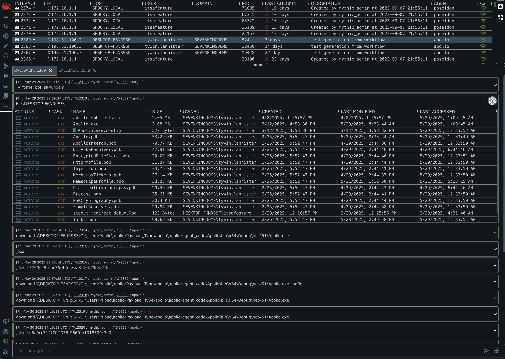
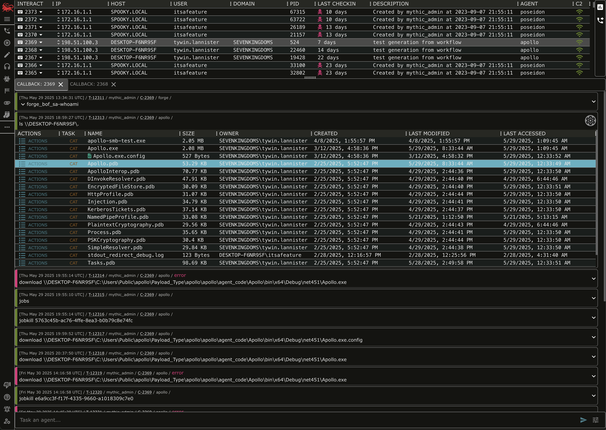
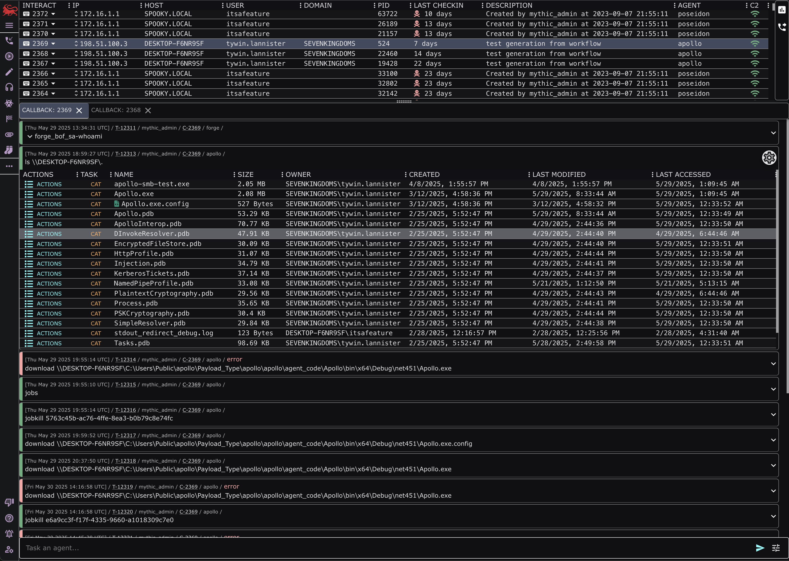

# CommunityThemes
A collection of Mythic UI Themes from the community and converted from other themes. The format of this repo is based on the awesome work done by the Binary Ninja team and their [community theme repository](https://github.com/Vector35/community-themes).

## Using themes

To install a theme:
1. go to your user settings
2. click the cog icon for your preferences
3. Click the upload icon in the top right

To save your current theme:
1. go to your user settings
2. click the cog icon for your preferences
3. click the download icon with a painter's palette icon next to it to save your palette config to your clipboard

## Contributing Themes

To submit a theme, create a pull request to the "proposed-themes" branch. You don't need to add screenshots, but you're welcome to do so.
I'll go through to create screenshots in a more consistent UI so people can compare between them.

## Converters

If you have color themes you like from another repository online, you're welcome to create a script to help convert them to Mythic themes. 
Just make sure you include the converter in the "converters" folder and update the LICENSE to indicate where the themes are coming from.

## Previews

### 35c3
from [Alexeyan](https://github.com/Alexeyan) via [BinaryNinja](https://github.com/Vector35/community-themes)

### Black Ocean
from [awt-256](https://github.com/awt-256) via [BinaryNinja](https://github.com/Vector35/community-themes)

### Blood Dragon
from [mechanicalnull](https://github.com/mechanicalnull) via [BinaryNinja](https://github.com/Vector35/community-themes)

### Blue Steel
from [toolCHAINZ](https://github.com/toolCHAINZ) via [BinaryNinja](https://github.com/Vector35/community-themes)

### Catppuccin Frappé
from [Krypton](https://github.com/kkrypt0nn) via [BinaryNinja](https://github.com/Vector35/community-themes)

### CMYK
from [toolCHAINZ](https://github.com/toolCHAINZ) via [BinaryNinja](https://github.com/Vector35/community-themes)

### Dracula
from [phoomparin](https://github.com/phoomparin) via [BinaryNinja](https://github.com/Vector35/community-themes)

### Dracula's Revenge
from [CX330Blake](https://github.com/CX330Blake)

(Released under an MIT license originally at [https://github.com/dracula/binary-ninja](https://github.com/dracula/binary-ninja))

### Gotham
from [zznop](https://github.com/zznop) via [BinaryNinja](https://github.com/Vector35/community-themes)

### Gruvbox Material
from [novafacing](https://github.com/novafacing) via [BinaryNinja](https://github.com/Vector35/community-themes) 

### Monochrome
from [Alexeyan](https://github.com/Alexeyan) via [BinaryNinja](https://github.com/Vector35/community-themes)

### Monokai
from [toolCHAINZ](https://github.com/toolCHAINZ) via [BinaryNinja](https://github.com/Vector35/community-themes)

### Nord
from [RobinJadoul](https://github.com/RobinJadoul) via [BinaryNinja](https://github.com/Vector35/community-themes)

### No Life
from [Alexeyan](https://github.com/Alexeyan) via [BinaryNinja](https://github.com/Vector35/community-themes)

### Orange Dusk
from Ben via [BinaryNinja](https://github.com/Vector35/community-themes)

### Resolve
from [robert-yates](https://github.com/robert-yates) via [BinaryNinja](https://github.com/Vector35/community-themes)

### Straylight
from [mechanicalnull](https://github.com/mechanicalnull) via [BinaryNinja](https://github.com/Vector35/community-themes)

### Synthwave
from [toolCHAINZ](https://github.com/toolCHAINZ) via [BinaryNinja](https://github.com/Vector35/community-themes)

### Throwback Green
from [mechanicalnull](https://github.com/mechanicalnull) via [BinaryNinja](https://github.com/Vector35/community-themes)

### Tokyo Night Storm
from [CX330Blake](https://github.com/CX330Blake) via [BinaryNinja](https://github.com/Vector35/community-themes)

### Vice
from [tonylambiris](https://github.com/tonylambiris) via [BinaryNinja](https://github.com/Vector35/community-themes)

